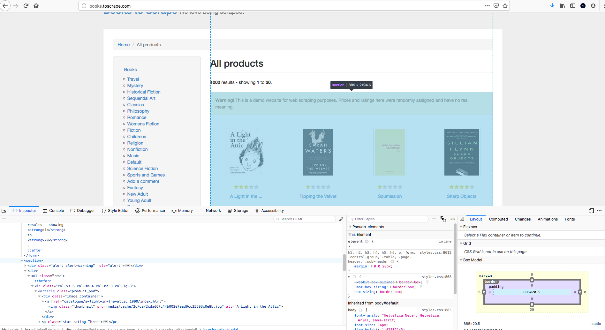

# Web Scraping In Practice

## Introduction

Now that you've gotten a brief introduction to Beautiful Soup and how to select various elements from a web page, its time to practice a hands-on case of scraping a website. You'll start to see that scraping is a dynamic process that involves investigating the web page(s) at hand and developing scripts tailored to those structures.

## Objectives

You will be able to:

* Load a web page into Beautiful Soup
* Use inspect element to find unique identifiers for elements of interest
* Navigate HTML documents using Beautiful Soup's children and sibling relations


```python
from bs4 import BeautifulSoup
import requests
```

## Grabbing an HTML Page

To start, here's how to retrieve an arbitrary web page and load its content into Beautiful Soup for parsing. You first use the requests package to pull the html itself and then pass that data to beautiful soup.


```python
html_page = requests.get('http://books.toscrape.com/') #Make a get request to retrieve the page
soup = BeautifulSoup(html_page.content, 'html.parser') #Pass the page contents to beautiful soup for parsing
```

## Previewing the Structure

While it's apt to be too much information to effectively navigate, taking a quick peek into the structure of the HTML page is always a good idea.


```python
soup.prettify
```

## Using the Inspect Element Feature

As you can see, there's a lot going on in a production level HTML page. Rather than tediously scrolling through all of this, you'll typically have specific information you're looking to pull from a page. For example, the page you've just loaded is a mock online bookstore used for scraping practice. (As noted in the previous lesson, be careful what you attempt to scrape and at what rate/volume; many websites will quickly blacklist you if you attempt to make too many requests.) For this page, you'll see how to programmatically extract the book names, cover images, and price. Once you have a goal in mind, you can right click on the portion of the page that you're interested in and select inspect element. This will bring up the developer's portion of your web broswer and allow you to preview the underlying html code.


This will also reveal underlying `divs`, `headers` and other containers the web designers have used to organize their web pages.




## Selecting a Container

While you're eventually looking to select each of the individual books, it's often easier to start with an encapsulating container. In this case, the `section`, displayed above. Once you select this container, you can then make sub-selections within it to find the relevant information you are searching for. In this case, the warning just above the div for the books is easy to identify. You can start by selecting this element and then navigating to the next div element.


```python
warning = soup.find('div', class_="alert alert-warning")
warning #Previewing is optional but can help you verify you are selecting what you think you are
```

## Traversing the Soup

Now, you can navigate to the section using the next sibling method. (In actuality you need to use nextSibling twice in this case.)


```python
#This code is a bit brittle but works for now; in general, ask, are you confident that this will work for all pages?
book_container = warning.nextSibling.nextSibling 
book_container
```

Now that you have the master container with all of the books of interest, you can then search within this smaller block to extract the relevant information. If you take a look at the preview above, you should see that each of the books is referenced twice: first as a simple link via an `a` tag and then again nested within an `h3` tag. You could, therefore, select all of the `a` tags and simply extract every other block of code, although this could be brittle and prone to error. A more reliable method would be to select only the `img` tags or only the `h3` tags. As you are starting to see, web scraping is a back and forth process of investigating a page and generalizing its structure.  

Generally, this is best done with a little trial and error: make a selection, preview it, and continue slicing down until you have what you're after.


```python
titles = book_container.findAll('h3') #Make a selection
titles[0] #Preview the first entry it
```

Looks like you need to further slice into these `h3` tags:


```python
titles[0].find('a')
```

Closer. Once you make it down to a single tag that's not nested, you can use the `.attrs` attribute to pull up a dictionary of the tag's attributes. In this case, you're looking for the title:


```python
titles[0].find('a').attrs['title']
```

Great! Now that you've done some exploration to find what you were after, you can formalize the process and put it all together.


```python
final_titles = [h3.find('a').attrs['title'] for h3 in book_container.findAll('h3')]
print(len(final_titles), final_titles[:5])
```

## Passing Regex Expressions

Another useful feature is passing regex expressions into a Find statement. For example, you may have noticed that the star ratings for each of the books are encapsulated within a p tag whose class reads "star-rating ...". Let's take a look at how you could extract these features.


```python
import re
```


```python
regex = re.compile("star-rating (.*)")
book_container.findAll('p', {"class" : regex}) #Initial Trial in developing the script
```

As you can see, as before, you need to navigate a little further in order to remove the extraneous information.


```python
star_ratings = []
for p in book_container.findAll('p', {"class" : regex}):
    star_ratings.append(p.attrs['class'][-1])
star_ratings
```

As you can see, even here we have strings whereas integers would probably be a more useful representation so you may still have to do some further data transformations.


```python
star_dict = {'One': 1, 'Two': 2, 'Three':3, 'Four': 4, 'Five':5} #Manually create a dictionary to translate to numeric
star_ratings = [star_dict[s] for s in star_ratings]
star_ratings
```

## Further Practice

You're definitely making some progress here! Let's take a look at extracting two more pieces of information: the price and availability.


```python
book_container.findAll('p', class_="price_color") #First preview
```


```python
prices = [p.text for p in book_container.findAll('p', class_="price_color")] #Keep cleaning it up
print(len(prices), prices[:5])
```


```python
prices = [float(p[1:]) for p in prices] #Removing the pound sign and converting to float
print(len(prices), prices[:5])
```

Hopefully, the process is starting to feel a bit smoother.


```python
avails = book_container.findAll('p', class_="instock availability")
avails[:5] #Preview our selection
```


```python
avails[0].text #Dig a little deeper into the structure
```


```python
avails = [a.text.strip() for a in book_container.findAll('p', class_="instock availability")] #Finalize the selection
print(len(avails), avails[:5])
```

## Putting it All Together

Now that you have the relevant information, it's time to put it all together into a dataset!


```python
import pandas as pd
```


```python
df = pd.DataFrame([final_titles, star_ratings, prices, avails]).transpose()
df.columns = ['Title', 'Star_Rating', 'Price_(pounds)', 'Availability']
df
```

## Pagination and URL Hacking

Now that you have successfully scraped one page of books, the next logical step is to extrapolate this to successive pages. In general, the two most common approaches are to search for a button that will take you to the next page or to investigate the structure of the page urls. For example, at the bottom of the page you should see a button like this:


As you can see, this portion contains a link to the next page of the book listings. What's more, is that you can also see that the next pages are easy to anticipate the url for. They're simply:

* http://books.toscrape.com/catalogue/page-2.html
* http://books.toscrape.com/catalogue/page-3.html
* http://books.toscrape.com/catalogue/page-4.html
* etc. 

In more complex examples, you would simply have to use selections such as those for the title, price, star rating and availability to retrieve the url of the next page. However, in simple cases like this, it is possible to simply hardwire the page urls in a for loop. In the upcoming lab, you'll formalize this knowledge by writing a script to scrape all 50 pages from the site. The pseudocode will look something like this:  

```python
df = pd.DataFrame()
for i in range(2,51):
    url = "http://books.toscrape.com/catalogue/page-{}.html".format(i)
    html_page = requests.get(url)
    soup = BeautifulSoup(html_page.content, 'html.parser')
    warning = soup.find('div', class_="alert alert-warning")
    book_container = warning.nextSibling.nextSibling
    new_titles = retrieve_titles(book_container)
    new_star_ratings = retrieve_ratings(book_container)
    new_prices = retrieve_prices(book_container)
    new_avails = retrieve_avails(book_container)
    ...
 ```

## Summary 

Well done! In this lesson, you took a look at some methods for traversing and dissecting a web page with beautiful soup! In the upcoming lab, you'll get some more practice working with this on your own!
